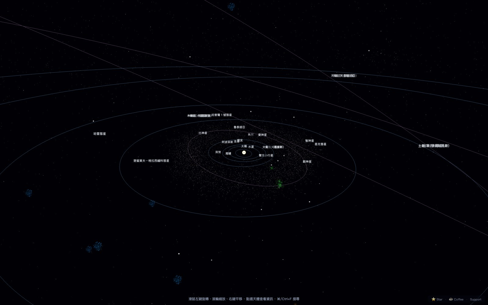
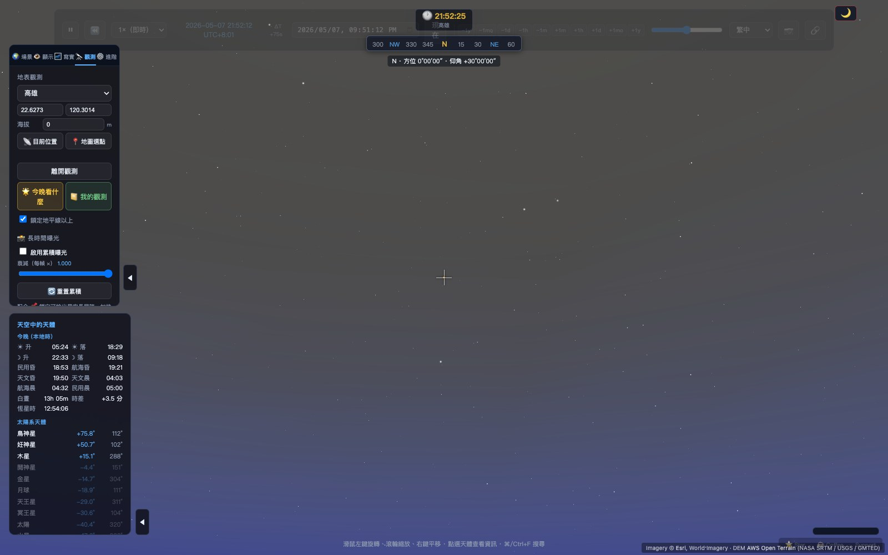
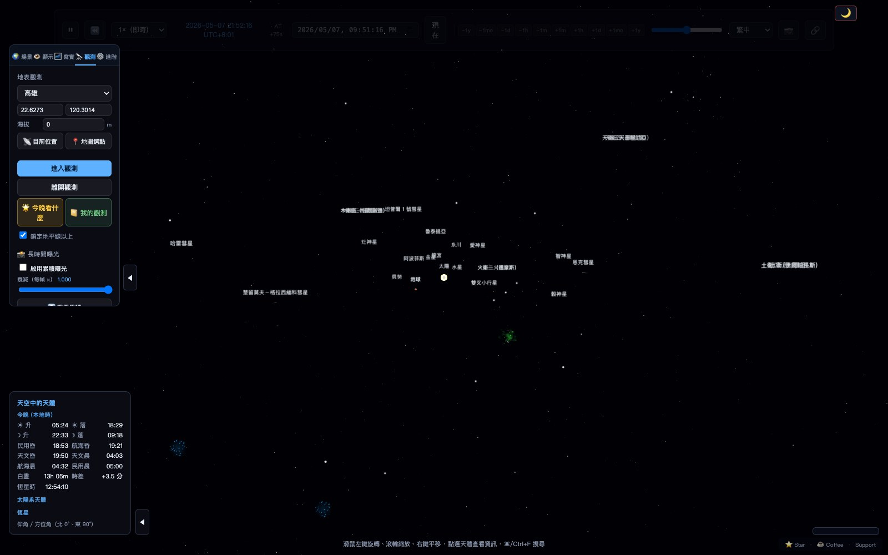

# Solar System 3D — fly out of our system, land in TRAPPIST-1, real Kepler all the way

**Click any of 12 exoplanet hosts in a 3D galaxy, land in real Kepler.** 太陽系模擬 / Solar System 3D 是一個瀏覽器內運行的可解釋天文模擬器：太陽系全景 + 地表觀星 + **銀河系飛越**三視角，用 Three.js + TypeScript + Vite 建置，每個位置背後都是 NASA JPL J2000 根數 + Newton-Raphson Kepler solver + 可選 Yoshida 4 階 N-body。

> **Live demo**: <https://solar-system-3d-kappa.vercel.app/>
> **🇹🇼 中文 · 🇺🇸 English · 🇯🇵 日本語**

<!-- TODO: drop ~/Desktop/show-hn-assets/climax-reel.mp4 here once committed -->
> Until the climax reel lands in this repo, the [live demo](https://solar-system-3d-kappa.vercel.app/) is the fastest way to see the `G` → galactic flythrough → click TRAPPIST-1 → land flow.

## Screenshots

### 太陽系全景（heliocentric）


### 地表觀測模式（observer）
站在地球任意點，看真實大氣染色的天空 + 今晚天象資訊板。


### 互動 UI
左側面板控制鏡頭模式、尺度（真實／對數／示意）、參考系（日心／地心）、書籤與光學工具。


> 截圖由 `npm run screenshots` 自動生成（puppeteer-core + 系統 Chrome），有更新時可重跑。

## Why this exists

幾乎每個線上「互動式太陽系」不是把行星畫成完美圓形（沒有離心率、沒有真實 inclination、近日點不會更快），就是把物理藏在漂亮的 UI 後面當魔術數字。前者沒有教育價值，後者沒有可驗證性。

這個專案反過來：**所有顯示的數字都該可以追溯到使用的模型與其精度範圍**。點任何一顆星就跳出「Physics under the hood」面板，列出 propagator、J2000 根數 (a, e, i, Ω, ω)、目前 JD 的狀態向量，附 JPL 資料來源連結。內建「ⓘ 模型精度」表 + N-body 守恆診斷 + 多維可觀測性評分，沒有黑盒。

## Feature highlights

- **銀河系飛越**：按 `G`，鏡頭從 AU 尺度推到 50 ly 鄰域（HYG 15k 真實 3D 位置）再推到 ~38k 點精靈組成的 4 條螺旋臂銀河盤面。沿途 12 顆已命名的系外行星宿主星浮現為可點擊光暈——TRAPPIST-1、Proxima Centauri、Kepler-90、Kepler-186、TOI-700、HD 209458 等。點 TRAPPIST-1，場景無縫切換成 7 顆地球大小行星繞 M8 矮星，用**完全相同的 Kepler solver** 跑 NASA Exoplanet Archive 的真實週期。`↩` 回銀河，`H` 回家。
- **真實 Kepler 不是裝飾**：8 大行星 + 太陽 + 月球 + 主要衛星 + Halley + Trojans 全部用 NASA JPL J2000 根數，每幀用 Newton-Raphson 解 `E - e·sinE = M`（含高 e 阻尼修正，防 Halley 級噴飛）。近日點真的會更快——不是手調的常數。
- **一鍵切換 N-body**：解析 Kepler 兩體傳播器 ↔ Velocity Verlet / Yoshida 4 階 symplectic 整合器。看數百年累積的攝動。symplectic 保 phase-space volume，比 RK4 在 Mercury 上撐得久。
- **Lagrange L1–L5 即時計算**：日-地、日-木、地-月每幀從目前兩體位置重算。打開後 follow 木星，可以實際看到 Achilles / Hektor / Patroclus / Eurybates 在 L4 / L5 群點。
- **點任何天體 → Physics under the hood**：propagator、J2000 根數 (a, e, i, Ω, ω)、目前 JD 狀態向量、JPL 資料來源連結，全部攤開。
- **食 + 太空船軌跡**：日食 / 月食 umbra / penumbra 路徑、JWST / Voyager 1&2 / Parker Solar Probe / New Horizons 軌跡 sample 自 JPL Horizons。
- **觀測者模式**：站在地球任意 lat/lon，看 atmosphere-shader 染色的天空、AWS Open Terrain DEM 真地形、Esri 衛星貼圖、大氣消光、Bortle 光害分級、IAU 88 星座連線與邊界、Bennett 折射、IAU 1976 歲差。
- **星表**：HYG 15 167 顆 mag<7 + Bright Star Catalog 8404 顆 + Messier 110 個深空天體 + 88 IAU 星座邊界（d3-celestial GeoJSON）。銀河背景用 ESO/Brunier GigaGalaxy Zoom 全景，IAU galactic-frame 矩陣對齊——Cygnus rift、Sgr A\*、Carina nebula 都對得上位置。
- **時間 + 計算工具**：暫停 / 倒轉 / 0.0001×–1 年/秒 / 跳到任意 datetime / 自動偵測未來 2 年 13 種天文事件、6 種光學預設（裸眼到 8" SCT）、相對距離 / 視線速度 / 合角即時計算。
- **智慧望遠鏡規劃**：14k+ DSO 目錄（Messier + NGC/IC 全集 11k + Sharpless 2 + Abell 富星系團 2712），按目標表面亮度 + 智慧望遠鏡口徑（Seestar S30/S50、Vespera Pro、Dwarf 3）即時估算 stack 時間，整合今晚天文夜窗判定可觀測性 → 一鍵加入觀測隊列。
- **可選 INDI / ASCOM 望遠鏡橋接**：搭配獨立 [solar-system-3d-bridge](https://github.com/kevinlin49361128-stack/solar-system-3d-bridge) helper，瀏覽器可顯示真實望遠鏡指向（Tier 1 唯讀），也能反向 GoTo / Sync / Park 控制（Tier 2，預設關閉、多層安全閘）。詳見 [`docs/future-telescope-bridge.md`](docs/future-telescope-bridge.md)。
- **Trilingual UI**：繁中 / English / 日本語，包含資料行 label、食接觸時間、propagator 描述、scale-tier banner——不只翻按鈕。
- **PWA 可安裝**，行動裝置響應式 + 雙指 pinch-zoom FOV。

## Quickstart

```bash
npm install
npm run dev          # Vite dev server, HMR
npm run build        # production build (含 tsc --noEmit)
npm run preview      # 看 build 結果
npm run typecheck    # tsc --noEmit
npm run test         # vitest run
npm run test:watch   # watch mode
```

需要：**Node 22+** (LTS, 跟 `.nvmrc` 對齊)、現代瀏覽器（WebGL2 + ES2022）。
用 nvm：`nvm use` 會自動讀 `.nvmrc`。

### 升 deps / 重生 lockfile

```bash
npm run lockfile:regen   # 強制走 npm 10.x（npm 11 的 lockfile 跟 npm ci 不相容）
```

背景：npm 11.x 在生 lockfile 時會把 esbuild 跨平台 binary 標
`extraneous: true`，CI 用 `npm ci` 會吐 EBADPLATFORM。已知 bug，
所以 lockfile 的生成統一走 npm 10。執行期間用 npm 11 跑 `npm ci`
跟 `npm run dev` 都沒問題。

## Architecture

三層分離：`src/physics/` 是純函數軌道力學，零 Three.js 依賴（Kepler solver、J2000 propagator、Velocity Verlet / Yoshida4、topocentric / GMST / Bennett / 歲差、Lagrange Newton-Raphson、event scanner）；`src/data/` 是純資料（行星根數、moons、dwarfs、comets、spacecraft、stars、constellations、belts）；`src/scene/` 是 Three.js 渲染層，從 propagator 拿位置（SolarSystem、BodyMesh、OrbitLine、Belt InstancedMesh、StarMap、RealStarfield ShaderMaterial、MessierLayer、IAUBoundaries、Spacecraft、AtmosphereSky、LocalTerrain、LocationPin）。`src/controls/`、`src/time/`、`src/ui/`（DOM overlay）、`src/i18n/` 各自獨立。

擴充原則：物理層用 `OrbitPropagator` interface 抽象（`physics/types.ts`），場景層完全不知道目前是 Kepler 還是 N-body。要加新天體只動 `data/`。詳見 [`src/`](src/) 原始碼。

## Telescope bridge (optional, INDI / ASCOM)

模擬器內建一個 WebSocket 客戶端，可選地對接一個跑在本機的 helper 行程，把瀏覽器跟你的赤道儀接起來：

- **Tier 1（唯讀）**：天球上多一個綠色十字標示望遠鏡目前指向，跟模擬器內的 crosshair 並列。
- **Tier 2（控制）**：點任何天體 → 望遠鏡 GoTo / Sync / Park。預設關閉；要勾「我了解風險」+ 設定最大移動角度 + Dec 上下限才會啟用；🛑 緊急停止隨時可用。

```bash
# 在另一個 terminal：
git clone https://github.com/kevinlin49361128-stack/solar-system-3d-bridge.git
cd solar-system-3d-bridge && npm install && node src/cli.js
# 預設 ws://localhost:7624/sim，會試著連 indiserver 在 127.0.0.1:7624
# 模擬器內：Realism 面板 → 🔭 INDI / ASCOM 望遠鏡橋接 → 連接
```

> 沒有實體望遠鏡也能試：模擬器這邊的 `examples/mock-bridge.mjs` 是個 60 行 Node 服務，會假扮成橋接、餵假的指向資料，方便驗證整條串聯。

Helper 是獨立 repo：<https://github.com/kevinlin49361128-stack/solar-system-3d-bridge>。詳細設計與安全模型見 [`docs/future-telescope-bridge.md`](docs/future-telescope-bridge.md)。

## What's verified

```bash
npm run test
```

目前 **253 個測試 / 23 個檔案** 全綠：

- **`kepler.test.ts`**：solver 在 e=0..0.995 全 M 範圍收斂、Halley 級高 e 回歸測試（防止之前的 Newton 噴飛 bug 復發）
- **`topocentric.test.ts`**：GMST 在 J2000 ≈ 280.46°、每日 +0.985° sidereal drift、observer frame 三軸正交、precession 100 年位移 1.0–1.6°、Bennett 折射對標準參考值
- **`frame.test.ts`**：黃道→場景軸映射、長度保留、不修改輸入
- 加上 nbody / lagrange / event scanner / exoplanet propagator / galactic frame 等覆蓋

UI / 整合測試還沒做（成本較高，物理回歸測試已經是 high-bug-density 區域的覆蓋）。

## Roadmap

**最近 ship**：銀河系飛越 + 12 顆系外行星宿主 click-to-land、Lagrange L1–L5 即時計算、click-through Physics under the hood 透明面板、Trojan 群點視覺化、PWA 安裝。

**桌上正在看**：planet-on-planet 陰影、Andromeda + 大小麥哲倫雲 billboard、系外行星宜居帶 overlay、行星自行（proper motion）+ 光行差修正、磁偏角校正（行動 AR 模式）、Hosek-Wilkie 黃昏漸層替換 Preetham。

**已知限制**：觀測者本地地形只覆蓋 ~45 km 半徑（25 個 zoom-12 tile）；恆星沒有 proper motion（拉到 1900 / 2100 會錯位）；N-body 只含太陽系內主要天體，彗星與太空船不參與攝動；行動陀螺儀 AR 在多支實機上未完整驗證。

## 第三方資料來源 / 授權

| 用途 | 來源 | 授權 |
|------|------|------|
| 行星根數 | [NASA JPL Approximate Positions](https://ssd.jpl.nasa.gov/planets/approx_pos.html) | Public domain |
| 系外行星 | NASA Exoplanet Archive | Public domain |
| 太空船軌跡 | JPL Horizons | Public domain |
| 名星 | Hipparcos / SIMBAD | Public domain |
| HYG 15k / BSC 8404 | HYG Database / Yale Bright Star Catalog | Public domain |
| Messier 深空 | NASA / IAU | Public domain |
| 88 星座邊界 | IAU 1930 / d3-celestial GeoJSON | MIT |
| 地形 DEM | [AWS Open Terrain (Terrarium)](https://github.com/tilezen/joerd) | Open data, attribution required |
| 衛星貼圖 | Esri World Imagery | **個人 / 開發用免費；公開部署需 ArcGIS Developer 帳號** |
| 地圖底圖 | OpenStreetMap via Leaflet | ODbL, © OpenStreetMap contributors |
| 行星紋理 | [Solar System Scope](https://www.solarsystemscope.com/textures/) | CC BY 4.0 |
| 銀河系全景 | [ESO / S. Brunier — GigaGalaxy Zoom (eso0932a)](https://www.eso.org/public/images/eso0932a/) | CC BY 4.0 |

公開部署前務必看 [docs/future-mobile-gyroscope.md](docs/future-mobile-gyroscope.md) 旁的注意事項，特別是 Esri 與 OSM tile 服務的條款。

## 開源套件

[Three.js](https://threejs.org) (MIT) · [Vite](https://vitejs.dev) (MIT) · [TypeScript](https://www.typescriptlang.org) (Apache-2.0) · [lil-gui](https://github.com/georgealways/lil-gui) (MIT) · [Leaflet](https://leafletjs.com) (BSD-2) · [Vitest](https://vitest.dev) (MIT) · [satellite.js](https://github.com/shashwatak/satellite-js) (MIT)

## License

- 程式碼：[MIT](LICENSE)
- 資料 / 文檔：[CC BY-SA 4.0](LICENSE-CONTENT.md)
- 第三方資料：依各來源授權，見上表

## 支持這個專案

這是免費、開源、無廣告的個人專案。如果它對你有幫助：

- ⭐ **Star** 這個 repo — 最直接的鼓勵
- ☕ [小額贊助](SUPPORT.md) — Buy Me a Coffee / GitHub Sponsors
- 🏫 [機構客製化](SUPPORT.md#-教育機構--客製化) — 天文館 / 學校 / 科教中心專屬版本
- 📧 寫信告訴我你怎麼用它（特別是教育用途）

詳見 [SUPPORT.md](SUPPORT.md)。

---

_Made with ☕ in Taiwan · 開源永續，由社群支持_
